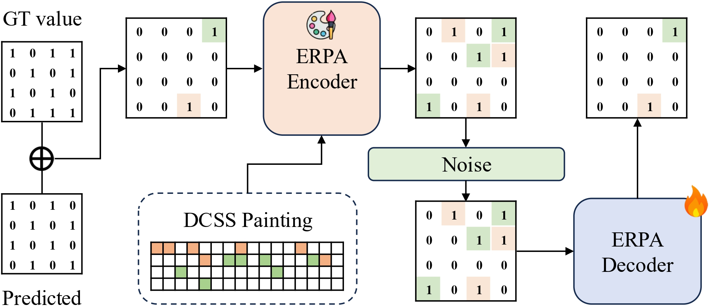

<div align="center">
<h1>README: Robust Error-Aware Digital Signature<br>via Deep Watermarking Model</h1>

[**Hyunwook Choi**](https://github.com/Eenrue)<sup>1</sup> · [**Sangyun Won**](https://github.com/comibear)<sup>1</sup> · [**Daeyeon Hwang**](https://github.com/neoqp)<sup>1</sup> · [**Junhyeok Choi**](https://github.com/chlwnsgurg)<sup>1</sup>

<sup>1</sup>Korea University


<a href="https://arxiv.org/abs/2507.04495"></a>
<a href='https://readme-2025.github.io'></a>

</div>


## 🎨 ERPA (ERror PAinting Module) Overview
<div align="center">

</div>
To enable error-aware watermarking suitable for cryptographic use cases, we propose ERPA, a novel mechanism designed to improve the bit-level reliability of watermark decoding under distortion. 
ERPA enhances bit-level watermark reliability through a deterministic encoder and a noise-robust neural decoder. 
The encoder spatially distributes error vectors using a Distinct Circular Subsum Sequence (DCSS), allowing the decoder to recover the original error pattern even under distortion.

## 📁 Repository Structure
├── model/ # Encoder/Decoder networks

├── scripts/ # Training and evaluation scripts

├── weights/ # Model weights

└── README.md


## 📌 Citation

```bibtex
@misc{choi2025readme,
  title={README: Robust Error-Aware Digital Signature via Deep Watermarking Model},
  author={Hyunwook Choi and Sangyun Won and Daeyeon Hwang and Junhyeok Choi},
  year={2025},
  institution={Korea University},
  note={\url{https://github.com/Eenrue/ERPA}}
}
